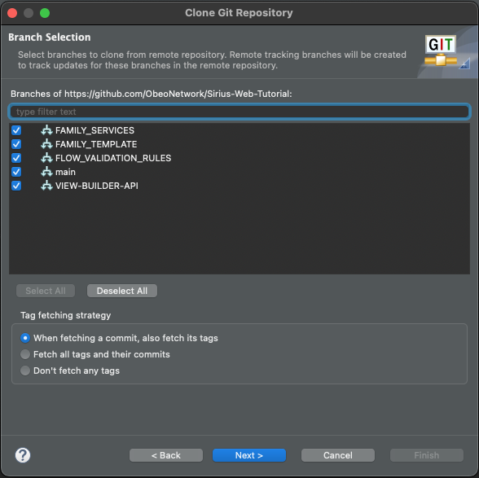
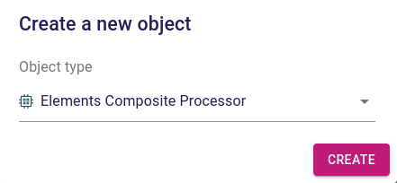
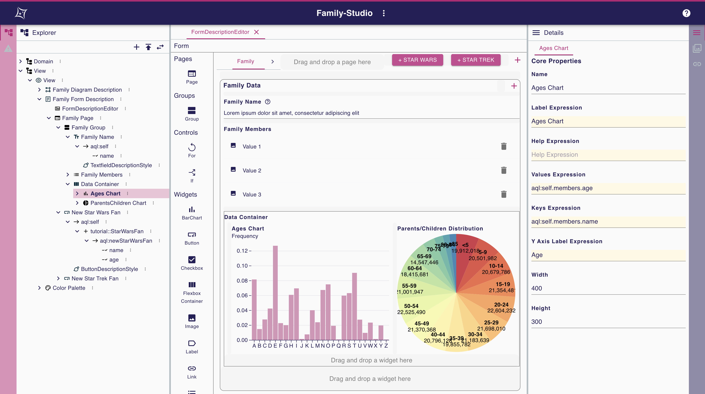

:source-highlighter: highlight.js

= Sirius Web tutorial for EclipseCon 2023

[IMPORTANT]
====
Speaker:: welcome and short overall presentation of:

. what the tutorial is about
. what are the objectives
. expected pre-requisites
. how the tutorial is organized (e.g. 3 hours, with 2 breaks)

Attendees:: listen and can ask for clarification before we proceed.
====

This 3 hours tutorial on _Eclipse Sirius Web_ has been designed for link:https://www.eclipsecon.org/2023[EclipseCon 2023].

You can also do it by yourself by following the steps below.

By the end of this tutorial, you should be able to create your own Sirius Web-based application with your own business domain and diagrams, ready to run and/or deploy on a server.

The structure of the tutorial is as follows:

. if you have not done so already beforehand, you will need to <<setup,install the required development tools>> and the sample application we prepared.
. after a short general presentation of Sirius Web, you will launch the sample application on your machine, and experiment as an _end-user_ the example studio it provides.
. then you will switch to the _studio maker_ role, and learn how to use Sirius Web to define your own studio directly from your browser.
This is the main part of the tutorial where we will spend the most time.
. finally you will see how more advanced features and use cases can be implemented by extending the Java-based backend.

There will be 2 10-minutes coffee/tea breaks.

[#setup]
== Installation/setup (~15 min)

[NOTE]
====
In this section you will:

. Install the development tools required to work on Sirius Web on your machine.
. Import the code from the example Sirius Web-based application we will be using.
. Get this initial version running locally.
====

[IMPORTANT]
====
Speaker:: go through the required setup steps along with the _attendees_.
Helpers:: make sure everybody follows along and nobody gets stuck.
====

First, download the _Spring Tools 4 for Eclipse_ specially designed for this tutorial.
Choose the bundle according to your OS:

* Windows x86_64: link:https://github.com/ObeoNetwork/Sirius-Web-Tutorial/releases/donwload/v1.0.0/sirius-web-tutorial-pack-win-1.0.0.zip[download Windows bundle on Obeo Network]
* Linux x86_64: link:https://github.com/ObeoNetwork/Sirius-Web-Tutorial/releases/donwload/v1.0.0/sirius-web-tutorial-pack-linux-1.0.0.zip[download Linux bundle on Obeo Network]
* macOS x86_64/arm_64: link:https://github.com/ObeoNetwork/Sirius-Web-Tutorial/releases/donwload/v1.0.0/sirius-web-tutorial-pack-mac-1.0.0.zip[download macOS bundle on Obeo Network]

It contains an embedded Java Runtime Environment, Maven and all the maven dependencies you will need for this tutorial.

Once unzipped, just launch it:

* Windows: run script `run.ps1` (run with PowerShell)
* Linux: run script `run.sh` (run with your favorite terminal)
* macOS: run script `run.ksh` (run with your favorite terminal)

The `run` shell script allows to configure the _Spring Tools 4 for Eclipse_ to the maven local repository contained in the bundle and then launch it.

Once launched, you need to clone or add the git repository (link:https://github.com/ObeoNetwork/Sirius-Web-Tutorial[Sirius-Web-Tutorial]) of the tutorial.

The repository contains:

. the source code of the sample application we will be using;
. the complete script of the tutorial itself;
. snapshots of the expected result at the end of each section in case you get stuck.

=== Clone repository

If you don't have already cloned the link:https://github.com/ObeoNetwork/Sirius-Web-Tutorial[Sirius-Web-Tutorial] git repository on your machine before, you just have to clone it from your Eclipse environment (If you already have, please go to <<#addrepo>> section).

For that, please go to _Window > Perspective > Open Perspective > Other..._ menu and then select _Git_.
From the _Git_ perspective, in the _Git Repositories_ view, click on _Clone a Git repository_ button:

Then, add `https://github.com/ObeoNetwork/Sirius-Web-Tutorial` in the `URI` field, and click on _Next >_ button:

Then, click on _Next >_ button:

Then, choose the local folder that will contain the git repository and click on _Finish_ button:

image::images/installation_clone_git_repository_4.png[Clone a Git repository, 60%]

Go to <<#importandrun>> section for the next step.

[#addrepo]
=== Add existing repository

If you have already cloned the link:https://github.com/ObeoNetwork/Sirius-Web-Tutorial[Sirius-Web-Tutorial] git repository on your machine before, you just have to add it to your Eclipse environment.

For that, please go to _Window > Perspective > Open Perspective > Other..._ menu and then select _Git_.
From the _Git_ perspective, in the _Git Repositories_ view, click on _Add an existing local Git repository_ button:

image::images/installation_add_local_git_repository.png[Add an existing local Git repository, 30%]

Browse on your OS the git repository of the tutorial. Select it and click on _Add_.
Now, you should see the git repository (`Sirius-Web-Tutorial`) on the _Git Repositories_ view.

[#importandrun]
=== Import & run sample application

Now you git repository is visible from your Eclipse environment, import the only project (`sirius-web-family-application`) contained in the local git repository.
Just right-click on the `Sirius-Web-Tutorial` repository in the _Git Repositories_ view, then click on _Import Projects..._ menu.

Now your project has been imported, please do a "Maven update" on it.
Just right-click on your project and click on Maven > Update Project... menu item.

Then, check the _Force Update of Snapshots/Releases_ and uncheck the _Update project configuration from pom.xml_ checkboxes.
Click on _OK_.

The last step is to create an _Eclipse launch configuration_ to run our Sirius Web application.
Go to _Run > Run Configurations..._ menu and then double-click on _Spring Boot App_.
Set the name, project, and main type as below:

Click on _Run_.
Your Sirius Web application is ready!

You should see the Spring Tools Suite console display the following text (starting with _Sirius Web Tutorial_ ASCII art):

Go to _http://localhost:8080_ on your favorite web browser for the next part of the tutorial!

=== Troubleshot

Please check in the Spring Tools Suite console you don't have any error message.
In particular, please check that your console does not look like this (console text starting with _Spring_ ASCII art):

In this case, please do a "Maven update" of your project.
Just right-click on your project and click on Maven > Update Project... menu item.

Then, check the _Force Update of Snapshots/Releases_ and uncheck the _Update project configuration from pom.xml_ checkboxes.
Click on _OK_.

Then retry to launch your _Eclipse launch configuration_.

[#sirius-presentation]
== Presentation performed by the Obeo team (~5 min)

[IMPORTANT]
====
Speaker:: give a short presentation of Sirius Web, based on link:https://docs.google.com/presentation/d/1Lob5F2C0jzd-_Ln2v-w9AbBjVhKO3o7dAmVgMcqLi6Q/edit?usp=sharing[slides]
Attendees:: listen and ask any question at the end.
====

Sirius Web allows to easily create and deploy graphical studios to the web.

It is an open-source _low-code_ platform to define custom web applications supporting your specific visual languages.

For more details and contents (videos, online documentation, private instance to experiment all Sirius Web's features), please visit the link:https://eclipse.dev/sirius/sirius-web.html[Sirius Web website].

For more details about the source code, please visit the link:https://github.com/eclipse-sirius/sirius-web[Sirius Web github repository].

== Experiment as an end-user (~25 min)

[NOTE]
====
In this section you will use the studio already configured in the application to create sample data and manipulate it through a diagram representation.
====

[IMPORTANT]
====
Speaker:: show the expected result, give rough idea of the main steps, explain major new concepts as needed.
Attendees:: reproduce the expected result. You have the detailed instructions if needed, but are encouraged to try by yourselves and to improvise/explore.
Helpers:: make sure everybody follows along and nobody gets stuck.
====

The sample application provided comes with a studio to model data flows between parts of an electronic system.
Your goal is to create a simple instance of this model and visualize/edit it through the (provided) graphical representation.
You should obtain something like this:

You will need to _create a project_ to store your data, _create the model_, edit it, and create a _diagram_ on it to visualize and further edit the model.

=== Projects View

The home page of Sirius Web shows the list of project templates (Blank Studio, Flow, Studio, Blank project, ...) and the list of already existing projects.

Create a _Flow_ project by clicking on the _Flow_ card.
You should now see the dedicated project page:

Flow contains an example model and a diagram representation based on the already packaged link:https://github.com/ObeoNetwork/Flow-Designer/[Flow metamodel].

=== Explorer View

The _Explorer_ view allows to see all the models contained in your project.
From this view, you can create, edit and delete models, objects and representations.

==== Create an object

To create an object, just select any object or model, and click on the menu icon associated (the three vertical dots), then click on the _New object_ menu item.

image::images/enduser_explorer_view_create_object_menu_flow.png[Explorer view - create object, 40%]

Select the type of model object you want to create and click on the _CREATE_ button.

The new object is visible in the _Explorer_ view.

image::images/enduser_explorer_view_create_object_result_flow.png[Explorer view - create object, 40%]

==== Rename an object

To rename an object, select it in the explorer, and click on the menu icon associated (the three vertical dots), then click on the _Rename_ menu item.

image::images/enduser_explorer_view_rename_object_menu_flow.png[Explorer view - rename object, 40%]

The selected tree item is now editable, you can set a new value.

==== Delete an object

To delete an object, select it in the explorer, and click on the menu icon associated (the three vertical dots), then click on the _Delete_ menu item.

image::images/enduser_explorer_view_delete_object_menu_flow.png[Explorer view - delete object, 40%]

=== Details View

The _Details_ view on the right shows all properties of the currently selected object.

It is updated from the selection in the _Explorer_ view or the active representation (diagram, form, ...).

From there, you can edit each property of the selected object.
Changes are applied immediately.

=== Representations area

The representations area shows all open representations (diagrams, forms, ...).

==== Create a representation

To create a representation, select any object in the _Explorer_ view, and click on the menu icon associated (the three vertical dots), then click on the _New representation_ menu item.

image::images/enduser_explorer_view_create_representation_menu_flow.png[Explorer view - create representation, 40%]

Select the representation type you want to create, set a name and click on the _CREATE_ button.

image::images/enduser_explorer_view_create_representation_dialog_flow.png[Explorer view - create representation, 40%]

NOTE: Not all representations are available on every type of element.

The new representation is visible in the _Explorer_ view and automatically open in the representations area.

==== Create object from a diagram

In this part of the tutorial, we are manipulating a diagram, which is one kind of representation.

To create objects inside a diagram, click on the diagram background, or any other object from the diagram.
A palette will show the available tools from this place.

image::images/enduser_diagram_palette_create_tool_flow.png[Diagram - create tool, 80%]

Click on the type of object you want to create.

==== Delete object from a diagram

To delete an object from the diagram, select it and the choose the _Delete_ tool on the palette (represented by the trashcan icon).

==== Rename object from a diagram

To rename an object from the diagram just select it.
A palette will show the available tools from this place.
Then you just have to click on the _Edit_ tool (the pen icon).

image::images/enduser_diagram_palette_rename_tool_flow.png[Diagram - rename tool, 30%]

The selected object's label is now editable, you can set a new value.

image::images/enduser_diagram_palette_rename_tool_edition_flow.png[Diagram - rename tool, 30%]

You can also just start typing the new value after the selection of the object, it will move to the editable mode.

=== Bonus Exercise

If you have finished the steps above before the time and you feel confortable enough, you can try the following bonus exercise (no solution given) or experiment yourself.

Exercise: Create a separate project, and try to reproduce the following diagram and model structure:

Hints:
- on this screenshot, the _Back_Camera_ element is an instance of the _DataSource_ type;
- it gets its special icon representing a camera because it's name contains the string "camera";
- see if you can find out how to create edges by yourself.

=== Collaborative edition performed by the Obeo team

The Obeo team will demonstrate the collaborative capacities of Sirius Web.

== Experiment as a studio maker: defining a domain (~25 min)

[NOTE]
====
For the rest of the tutorial you will switch roles from _end-user_ of an already existing studio to _studio maker_ to create your own.
The first step is to tell Sirius Web about the structure of the business domain for your studio, which is the goal of this section.
We'll see how to configure graphical representations (e.g. diagrams) specifically designed for this domain in the next one.
====

[IMPORTANT]
====
Speaker:: show the expected result, give rough idea of the main steps, explain major new concepts as needed.
Attendees:: reproduce the expected result. You have the detailed instructions if needed, but are encouraged to try by yourselves and to improvise/explore.
Helpers:: make sure everybody follows along and nobody gets stuck.
====

In Sirius Web, one of the key features is the ability to define your own domain and the associated representations (e.g. diagrams) to view and edit it.
Together, the domain and accompanying representations are called a _studio_.

As a studio maker you will create your studio definition entirely through the web browser, using the same UI as you used in the previous part of the tutorial.

Once your studio has been defined, it can be used by other users, who can:

. create concrete instances of the concepts described in the new domains;
. visualize and manipulate these instances through the representations defined in the studio.

In this part of the tutorial, as a studio maker, we will create a new studio, and then use is as an end-user.

In Sirius Web, a _Domain_ is composed with _Entities_ and _Relations_ objects.
An _Entity_ may have _Attributes_, _Entities_ and _Relations_.
A _Relation_ is a connection between two _Entities_.
An _Attribute_ is either a _Text_, _Boolean_ or a _Number_.

In this section, your goal is to create a very simple _Family_ domain with the following structure:

image::images/studio_maker_family_domain_step1_final.png

To Sirius, a domain is a model (almost) like any other, so you will be using the same mechanisms as above when creating the Flow example.

[NOTE]
====
If you do not want to specify yourself a new domain, you can upload the files we prepared:

. Go back to the main page with the projects list (you can click on the Sirius logo in the top-left).
. Click on the "Upload project" card.
. Click on the "Click here to select a file" link, then select the `solutions/Family-Studio-Step1.zip` from the tutorial sources and then click on "UPLOAD".
. You will be redirected to a newly created _Family Studio_ project with the domain already defined.
====

First, from the home page, click on the _Blank Studio_ template.

IMPORTANT: Make sure to create a _Blank Studio_ and not a plain _Blank Project_.

Then, create a _Domain_ model, in the _Create a new model_ section.

image::images/studio_maker_new_domain.png[Studio Maker - new domain]

It creates a new document named _Domain_ containing an object named _Domain_.
It will initialy have a randomly chosen name.
Using the _Details_ view, rename this object from _Domain_ to _tutorial_.

image::images/studio_maker_domain_rename.png[Studio Maker - rename domain]

Then, create a _Domain_ diagram on this _tutorial_ domain object.
While not strictly necessay, it will make it easier to create and modify our domain specific language than using just the _Explorer_ and _Details_ views.
To create this diagram, select the _tutorial_ object in the _Explorer_ view, and click on the menu icon associated (the three vertical dots), then click on the _New representation_ menu item.

image::images/studio_maker_domain_create_domain_diagram_menu.png[Studio Maker - create domain diagram]

Select the representation type you want to create (_Domain_), set a name and click on the _CREATE_ button.

The new representation is visible in the _Explorer_ view and automatically open in the representations area.
It will be empty initially, as our new domain does not currently define any concept.

image::images/studio_maker_domain_create_domain_diagram_result.png[Studio Maker - create domain diagram]

Let's create the concepts we will manipulate later.

From the diagram background, create an _Entity_ named _Family_ and another named _Person_.

Let's link our two _Entities_ with a _Relation_.

From the _Family_ object, click on the _Connector_ tool (the first one in the _Palette_), and then click on the _Person_ object.

image::images/studio_maker_domain_create_relation_tool.png[Studio Maker - create relation]

Three options are displayed on the screen, _Relation_, _Containment_ and _Supertype_.
Select _Containment_ option. Indeed, a _Family_ will contains a set of _Person_.

image::images/studio_maker_domain_create_relation_tool_target.png[Studio Maker - create relation]

You should now see a _Relation_ between the _Entities_.

In the _Details_ view, just rename the link form _persons_ to _members_.

Almost done!
We finish this first specification part by adding a _name_ attribute to _Family_ and _Person_.

In the diagram, click on the _Family_ object and select the _Text_ attribute tool.

Set its name to _name_.
Do the same for _Person_.
You should now have a domain looking like this:

Just one last thing!
You can go back to the home page (through the Sirius icon on the top left corner) and then rename your project from _Blank Studio_ to _Family-Studio_.
Click on the menu icon associated (the three horizontal dots) to _Blank Studio_, then click on the _Rename_ menu item.

image::images/studio_maker_rename_project.png[Studio Maker - rename project]

=== Test the studio

To test our studio, we need to create a new project with _instances_ of the concepts we defined.

[NOTE]
====
If you do not want to create the domain instance yourself, you can upload the files we prepared.
. Go back to the main page with the projects list (you can click on the Sirius logo in the top-left).
. Click on the "Upload project" card.
. Click on the "Click here to select a file" link, then select the `Family-Instance-Step1.zip` from the tutorial sources and then click on "UPLOAD".
. You will be redirected to a newly created _Family Instance_ project with the domain already defined.

Note that this requires that the corresponding domain has been correctly defined as above.
====

From the home page, click on the _Blank project_ template.

Name this new project _Family-Instance_.

Then, create an _Others..._ model, in the _Create a new model_ section.

image::images/enduser_new_others.png[End-user - new document]

From this new _Others..._ model, click on the menu icon associated (the three vertical dots), then click on the _New object_ menu item.

Make sure the _Domain_ selected is the one we defined above, `domain://tutorial`.
Select the type of model object you want to create (here a _Family_) and click on the _CREATE_ button.

Name the _Family_ (from the _Details_ view or with the _Rename_ menu item).
Then, create one or two _Person_ and rename them.

Select the type of model object you want to create (here a _Person_) and click on the _CREATE_ button.

Your instance model should look like this:

image::images/enduser_family_instance_step1_final.png[End-user - step 1 - final, 40%]

== COFFEE/TEA BREAK! (~10 min)

== Experiment as a studio maker: defining a diagram to visualize our new domain (~20 min)

[NOTE]
====
We now have defined our custom domain, however simple (the basic structure of a Family).
We can create and edit concrete _instances_ (the concrete family), but currently only through the _Explorer_ view (the instance's structure) and _Details_ (the properties of each specific element).

The power of Sirius Web is that for each domain you (as a studio maker) can define custom _representations_ (typically diagrams or forms, but it can be almost anything) adapted to the domain for end-users.

In this section you will create a simple diagram representation for families.
====

Now we have a domain, we want to be able to manipulate it graphically.
In the _Studio_, this part is called _View_.
A _View_ allows to define the description of representations (diagrams, forms, ...).
A _Diagram Description_ contains a set of _Node Descriptions_ and _Edges Descriptions_.
A _Node Description_ contains the information needed to display an _Entity_ on a diagram.
An _Edge Description_ contains the information needed to display a _Relation_ (or an _Entity_) on a diagram.

[NOTE]
====
If you do not want to specify yourself a new view, please upload in Sirius Web the projects we already prepared (see the previous sections for how to upload a project from a zip).

. Delete the existing _Family-Instance_ and _Family-Studio_ beforehand to avoid conflicts.
. Upload the provided `solutions/Family-Studio-Step2.zip` file, which contains the studio definition with both the domain and simple diagram definition.
. Upload the provided `solutions/Family-Instance-Step2.zip` file, which contains an example family and diagram.
====

First, create a _View_ model, in the _Create a new model_ section.

image::images/studio_maker_new_view.png[Studio Maker - new view]

It creates a new document named _View_ containing a view named _View_, and a diagram description named _New Diagram Description_ and a _Color Palette_ with some predefined colors.

image::images/studio_maker_new_view_2.png[Studio Maker - new view]

From the _Details_ view:

* Rename this object from _New Diagram Description_ to _Family Diagram Description_.
* Set the domain type (the type of object on which we want to create this type of diagram) to `tutorial::Family`.
* Set the _Title Expression_ to `Family Representation`.

image::images/studio_maker_view_diagram_description_set_properties.png[Studio Maker - diagram description - set properties]

This is enough to be able to create diagrams on _Family_ instances, but they would be blank.
Let's tell Sirius Web what kind of elements (nodes) to display on these diagrams.

From the _Family Diagram Description_, create a new _Node Description_ by clicking on the menu icon associated (the three vertical dots), then click on the _New object_ menu item.

image::images/studio_maker_view_create_node_description_menu.png[Studio Maker - diagram description - create node description, 40%]

Select the _Node Description_ object type and click on the _CREATE_ button.

image::images/studio_maker_view_create_node_description_dialog.png[Studio Maker - diagram description - create node description, 40%]

A new _Node Description_ is visible in the _Explorer_ view.

After selecting the _Node Description_ in the _Explorer_ view, let's change its properties in the _Details_ view:

* Set the name to _Person Node_
* Set the domain type to `tutorial::Person`: each of these nodes will represent an instance of the _Person_ type.
* Set the semantic candidates expression to `aql:self.members`: we want to get one node for each member of the family.
* Set the label expression to `aql:self.name`: the node will display the name of the _Person_ it represents.

NOTE: if you want more details about the meaning of all elements and properties of the _Studio_, please go to https://docs.obeostudio.com/

NOTE: if you want more details about AQL, the model query language, please go to https://eclipse.dev/acceleo/documentation/

Inside this _Color Palette_ (available int he _Explorer_ just below the _View_ element), let's create 3 custom colors:

* _person_background color_ with value `#f7e6f0`
* _person_border_color_ with value `#242055`
* _person_label_color_ with value `#242055`

From the _Color Palette_ object, create a new _Color_ by clicking on the menu icon associated (the three vertical dots), then click on the _New object_ menu item.

image::images/studio_maker_view_color_palette_create_color_menu.png[Studio Maker - view - create color, 40%]

Select the _Fixed Color_ object type and click on the _CREATE_ button.

The colors have been created.
Let's use those colors for the _Person Node_ object.
In the _Explorer_ view, click on the _RectangularNodeStyleDescription_ under the _Person Node_ object.
Set its properties:

* _Width Expression_ to `100`
* _Width Expression_ to `70`
* _Label Color_ to `person_label_color`
* _Color_ to `person_background_color`
* _Border Color_ to `person_border_color`

Finally, let's create a tool allowing to create a _Person_ inside the diagram.
For this we need to setup the palette of tools that will be displayed when the user clicks on the diagram's background.

From the _Family Diagram Description_ object, create a new _Palette_ by clicking on the menu icon associated (the three vertical dots), then click on the _New object_ menu item.

Select the _Palette_ object type and click on the _CREATE_ button.

From the the _DiagramPalette_ object, create a new _Node Tool_ by clicking on the menu icon associated (the three vertical dots), then click on the _New object_ menu item.

Select the _Node Tool_ object type and click on the _CREATE_ button.

image::images/studio_maker_view_diagram_palette_create_node_tool_dialog.png[Studio Maker - diagram palette - create node tool, 40%]

From the _Details_ view, rename this _Node Tool_ to _Person_.

From the the _Node Tool_ object, create a new _Create Instance_ by clicking on the menu icon associated (the three vertical dots), then click on the _New object_ menu item.

Select the _Create Instance_ object type and click on the _CREATE_ button.

From the _Details_ view, set the properties of the _Create Instance_ object:

* _Type Name_ to `tutorial::Person`
* _Reference Name_ to `members`
* _Variable Name_ to `newPerson`

image::images/studio_maker_view_person_tool_create_instance_set_properties.png[Studio Maker - create instance - set properties]

At this stage, our creation tool should work.
But would it be better if a new _Person_ created from this tool was created with a default name?
Let's do that.

From the the _Create Instance_ object, create a new _Change Context_ by clicking on the menu icon associated (the three vertical dots), then click on the _New object_ menu item.

image::images/studio_maker_view_node_tool_change_context_menu.png[Studio Maker - node tool - change context, 40%]

Select the _Change Context_ object type and click on the _CREATE_ button.

image::images/studio_maker_view_node_tool_change_context_dialog.png[Studio Maker - node tool - change context, 40%]

From the _Details_ view, set the properties of the _Change Context_ object:

* _Expression_ to `aql:newPerson`

From the the _Change Context_ object, create a new _Set Value_ by clicking on the menu icon associated (the three vertical dots), then click on the _New object_ menu item.

image::images/studio_maker_view_node_tool_set_value_menu.png[Studio Maker - node tool - set value, 40%]

Select the _Set Value_ object type and click on the _CREATE_ button.

From the _Details_ view, set the properties of the _Set Value_ object:

* _Feature Name_ to `name`
* _Value Expression_ to `new Person`

image::images/studio_maker_view_person_tool_set_value_set_properties.png[Studio Maker - set value - set properties]

Now test this second part as an end-user!

=== Test the studio

From the home page, click on the _Family-Instance_ project.

From the _Explorer_ view, select your _Family_ object and create a new _Family Diagram Description_ by clicking on the menu icon associated (the three vertical dots), then click on the _New representation_ menu item.

Select the representation type you want to create (a _Family Diagram Description_), set a name and click on the _CREATE_ button.

The new representation is visible in the _Explorer_ view and automatically open in the representations area.

Click on the background of the diagram, then click on the _Person_ tool.

image::images/enduser_family_diagram_person_tool.png[End-user - diagram - person tool]

There you go! The new _Person_ is visible in the diagram and the _Explorer_ view.

image::images/enduser_family_instance_step2_final.png[End-user - diagram - person tool]

=== Bonus Exercise

If you have finished the steps above before the time and you feel confortable enough, you can try the following bonus exercice (no solution given) or experiment yourself:

. Update the diagram definition to display the full names of the persons (e.g. "Gomez Adams" instead of just "Gomez"). Hint: The reference documentation for AQL, which is used for computed expressions, is https://eclipse.dev/acceleo/documentation/aql.html[here].

== Experiment as a studio maker: add relations and display them on the diagram (~10 min)

In this third part of the experiment, we will add a new _Relation_ named _children_ to our _Family_ domain and also display it graphically in the associated _View_.

[NOTE]
====
If you don't want to specify yourself this part, please upload in Sirius Web the projects we already prepared (see the previous sections for how to upload a project from a zip).

. Delete the existing _Family-Instance_ and _Family-Studio_ beforehand to avoid conflicts.
. Upload the provided `Family-Studio-Step3.zip` file, which contains the studio definition with both the domain and simple diagram definition.
. Upload the provided `Family-Instance-Step3.zip` file, which contains an example family and diagram.
====

From the home page, click on the _Family-Studio_ project.
In the _Family-Studio_ project, open the _Domain_ diagram.
Then in the diagram, click on the _Person_ object, select the _Connector_ tool (the first one).
Click on the _Person_ again (indeed the _children_ will start from a _Person_ an will target others _Persons_) and select _Relation_ (the first choice in the list).

Select this new _Relation_ to _children_ and set its properties:

* _Name_ to `children`
* _Optional_ to `true`
* _Many_ to `true`
* _Containment_ to `false`
* _Target Type_ to `Entity Person`

image::images/studio_maker_domain_person_create_relation_children_set_properties.png[Studio Maker - domain relation - set properties]

Then, in the _View_ model, from the _Family Diagram Description_ object, create an _Edge Description_ and set its properties:

* _Name_ to `Children Edge`
* _Domain Type_ to `tutorial::Person`
* _Semantic Candidates Expression_ to empty value
* _Precondition Expression_ to empty value
* _Synchronization Policy_ to `SYNCHRONIZED`
* _Label Expression_ to empty value
* _Begin Label Expression_ to empty value
* _End Label Expression_ to empty value
* _Is Domain Based Edge_ to `false`
* _Source Node Descriptions_ to `Person Node`
* _Target Node Descriptions_ to `Person Node`
* _Source Node Expression_ to `aql:self`
* _Target Node Expression_ to `aql:self.children`

image::images/studio_maker_view_create_edge_set_properties.png[Studio Maker - view edge - set properties]

You can also set the color of the edge by clicking on the _EdgeStyle_ object inside the _Children Edge_ object.
Then change the _Color_ properties in the _Details_ view to `person_border_color`.

image::images/studio_maker_view_edge_style_set_properties.png[Studio Maker - view edge style - set properties]

=== Test the studio

From the home page, click on the _Family-Instance_ project.

From the _Explorer_ view, open your _Family Representation_ diagram.

Then click on a _Person_ in the diagram.
In the _Details_ view you should see a new property named _Children_.
From this property, set the _Persons_ you want as children of the selected _Person_.

You should see your diagram updated instantaneously with new edges:

== Experiment as a studio maker: update existing domain & view (~10 min)

In this fourth part of the experiment, we will create sub-types to _Person_ (_StarWarsFan_ and _StarTrekFan_), and add a new _Conditional Styles_ to our _Person Node_ in the _View_.

[NOTE]
====
If you don't want to specify yourself this part, please upload in Sirius Web the projects we already prepared (see the previous sections for how to upload a project from a zip).

. Delete the existing _Family-Instance_ and _Family-Studio_ beforehand to avoid conflicts.
. Upload the provided `Family-Studio-Step4.zip` file, which contains the studio definition with both the domain and simple diagram definition.
. Upload the provided `Family-Instance-Step4.zip` file, which contains an example family and diagram.
====

From the home page, click on the _Family-Studio_ project.
In the _Family-Studio_ project, open the _Domain_ diagram.
Then in the diagram, click on the diagram background, select the _Entity_ tool (the first one).
Name this _Entity_: _StarTrekFan_ and do the same for _StarWarsFan_.

Select the _StarTrekFan_ _Entity_ and from the _Details_ view, select _Person_ as _Super Types_.
Do the same for _StarWarsFan_.
Finally, make _Person_ abstract from the _Details_ view.

Your domain should look like this:

Lets' add some _Conditional styles_ to our _View_.

From the the _Person Node_ object, create a new _Conditional Node Style_ by clicking on the menu icon associated (the three vertical dots), then click on the _New object_ menu item.

image::images/studio_maker_view_person_node_conditional_style_menu.png[Studio Maker - node - conditional style, 40%]

Select the _Conditional Node Style_ object type and click on the _CREATE_ button.

Select this new _Conditional Node Style_ and set its properties:

* _Condition_ to `aql:self.oclIsKindOf(tutorial::StarTrekFan)`

image::images/studio_maker_view_person_node_conditional_style_set_properties.png[Studio Maker - node - conditional style - set properties]

From the the _Conditional Node Style_ object, create a new _Image Node Style Description_ by clicking on the menu icon associated (the three vertical dots), then click on the _New object_ menu item.

image::images/studio_maker_view_person_node_conditional_style_image_node_style_menu.png[Studio Maker - node - conditional style - image node style, 40%]

Select the _Image Node Style Description_ object type and click on the _CREATE_ button.

Select this new _Image Node Style Description_ and set its properties:

* _Shape_ to `star-trek-1` or `star-trek-2`
* _Width Expression_ to `70`
* _Height Expression_ to `70`
* _Show Icon_ to `false`
* _Label Color_ to `person_label_color`
* _Border Radius_ to `3`
* _Border Size_ to `0`

Now add a new _Conditional Node Style_ but this time for _StarWarsFan_.

Finally, update the _DiagramPalette_: add new creation tools for _StarTrekFan_ and _StarWarsFan_.
It is the same than the existing creation tool for _Person_ but with adapted values.
After that, you can remove the _Person_ creation tool cause it is now useless.
Indeed, _Person_ is now an abstract _Entity_ and cannot be instantiated anymore.

At the end, your _View_ should look like this:

=== Test the studio

WARNING: The evolution we have made to our domain makes the existing model in _Family-Instance_ obsolete.
You must delete the _Family-Instance_ project from the home page.

From the home page, click on the _Blank project_ template.

Name this new project _Family-Instance_.

Then, create an _Others..._ model, in the _Create a new model_ section.

image::images/enduser_new_others.png[End-user - new document]

From this new _Others..._ model, click on the menu icon associated (the three vertical dots), then click on the _New object_ menu item.

Select the type of model object you want to create (here a _Family_) and click on the _CREATE_ button.

Name the _Family_ (from the _Details_ view or with the _Rename_ menu item).

From the _Explorer_ view, create _Family Representation_ diagram from the _Family_ object.

Click on the background of the diagram, and select the _StarTrekFan_ tool.
Do the same for the _StarWarsFan_ tool.

Then click on a _Person_ (a _StarTrekFan_ or a _StarWarsFan_) in the diagram.
In the _Details_ view you should see a new property named _Children_.
From this property, set the _Persons_ you want as children of the selected _Person_.

You should see your diagram updated instantaneously with new edges:

== COFFEE/TEA BREAK! (~10 min)

== Sirius Web forms demonstration performed by the Obeo team (~5 min)

Diagrams are not the only kind of representation provided by default by Sirius Web.
Forms are also a great tool to display data to the users.

NOTE: If you want to benefit from this part of the tutorial, please upload in Sirius Web the projects _solutions/Family-Studio-Step5.zip_ and then _solutions/Family-Instance-Step5.zip_.
Do not forget to delete existing projects from previous steps before.

Here is an example of what can be done from the studio maker side:

Here is the result from the end-user side:

image::images/enduser_family_instance_step5_final.png[End-user - step5 - final]

== Experiment as studio developer (~35 min)

To develop more advanced features for your studios, which can not (yet) be implemented directly through the web UI, you can also do a lot of things programmatically (Java services, project templates, custom validation rules, representations descriptions...).

Let's implement some of them!

=== Java Services (~10 min)

So far in the studio definition we have used AQL expressions to navigate inside our models and to compute some values (for example labels).
Sometimes you need to perform more complex computations that what can be (easily) expressed in AQL.
Fortunately, Sirius Web makes it pretty easy to call into custom Java code directly from AQL using what's called _Java Services_.

The actual Java services:

[source,java]
----
import org.eclipse.emf.ecore.EClass;
import org.eclipse.emf.ecore.EObject;

public class FamilyServices {

    // aql:self.name + ' ' + self.eContainer().name
    public String fullName(EObject person) {
        if (this.isInstance(person, "tutorial", "Person")) {
            EObject parent = person.eContainer();
            if (this.isInstance(parent, "tutorial", "Family")) {
                String familyName = (String) this.getAttribute(parent, "name");
                String ownName = (String) this.getAttribute(person, "name");
                return ownName + " " + familyName;
            }
        }
        return "";
    }

    private Object getAttribute(EObject object, String attributeName) {
        return object.eGet(object.eClass().getEStructuralFeature(attributeName));
    }

    private boolean isInstance(EObject object, String domain, String typeName) {
        if (object != null) {
            EClass klass = object.eClass();
            return klass.getName().equals(typeName) && klass.getEPackage().getName().equals(domain);
        } else {
            return false;
        }
    }

}
----

Simpler version, but with no checks at all:

[source,java]
----
public class FamilyServices {
    // aql:self.name + ' ' + self.eContainer().name
    public String fullName(EObject person) {
        return this.getName(person.eContainer()) + " " + this.getName(person);
    }

    private String getName(EObject object) {
        return (String) object.eGet(object.eClass().getEStructuralFeature("name"));
    }
}
----

We also need to tell Sirius Web about this new class, but is should only be available in our Family studio.
This is done by registering an `IJavaServiceProvider` Spring bean:

[source,java]
----
import java.util.List;

import org.eclipse.sirius.components.view.View;
import org.eclipse.sirius.components.view.diagram.DiagramDescription;
import org.eclipse.sirius.components.view.emf.IJavaServiceProvider;
import org.eclipse.sirius.web.sample.services.FamilyServices;
import org.springframework.stereotype.Service;

@Service
public class FamilyServicesProvider implements IJavaServiceProvider {
    @Override
    public List<Class<?>> getServiceClasses(View view) {
        boolean isTestView = view.getDescriptions().stream()
                .filter(DiagramDescription.class::isInstance)
                .map(DiagramDescription.class::cast)
                .anyMatch(diagramDescription -> diagramDescription.getDomainType().equals("tutorial::Family"));
        if (isTestView) {
            return List.of(FamilyServices.class);
        }
        return List.of();
    }
}
----

Once this is done and the backend has restarted, we can now use our new service method (`fullName`) from AQL expressions in our Family Studio.
In the _Family Diagram Description_, change the _Label Expression_ for _Person Node_ to: `aql:self.fullName()`.
Re-open the diagram.

=== Project Templates (~10 min)

From the homepage of Sirius Web, you can see some project templates.
In Sirius Web, a template is a project initializer and accelerator.

image::images/studio_maker_templates.png[Studio Developer - templates]

Please checkout the tag `FAMILY_TEMPLATE` from your Sirius Web local git repository to retrieve the result of the demonstration done by Obeo and test it by yourself.

There are two interfaces to implement to provide a new template in Sirius Web:

* an `IProjectTemplateProvider`
* an `IProjectTemplateInitializer`

For the `IProjectTemplateProvider`, the code look like this:

[source,java]
----
import java.util.List;

import org.eclipse.sirius.web.services.api.projects.IProjectTemplateProvider;
import org.eclipse.sirius.web.services.api.projects.ProjectTemplate;
import org.springframework.context.annotation.Configuration;

@Configuration
public class FamilyProjectTemplatesProvider implements IProjectTemplateProvider {

    public static final String FAMILY_TEMPLATE_ID = "family-template";

    @Override
    public List<ProjectTemplate> getProjectTemplates() {
        var flowTemplate = ProjectTemplate.newProjectTemplate(FAMILY_TEMPLATE_ID)
                .label("Family")
                .imageURL("/images/Family-Template.svg")
                .natures(List.of())
                .build();
        return List.of(flowTemplate);
    }
}
----

For the `IProjectTemplateInitializer`, the code look like this:

[source,java]
----
import org.eclipse.sirius.web.services.api.projects.IProjectTemplateInitializer;
import org.springframework.context.annotation.Configuration;

@Configuration
public class FamilyProjectTemplatesInitializer implements IProjectTemplateInitializer {

    @Override
    public boolean canHandle(String templateId) {
        return FamilyProjectTemplatesProvider.FAMILY_TEMPLATE_ID.equals(templateId); //<1>
    }

    @Override
    public Optional<RepresentationMetadata> handle(String templateId, IEditingContext editingContext) {
        if (FamilyProjectTemplatesProvider.FAMILY_TEMPLATE_ID.equals(templateId)) {
            return this.initializeFamilyProject(editingContext); //<2>
        }
        return Optional.empty();
    }
}
----
<1> this template initializer only applies when the `FamilyProjectTemplatesProvider` is called.
<2> the content of `initializeFamilyProject` is described below.

[source,java]
----
private Optional<RepresentationMetadata> initializeFamilyProject(IEditingContext editingContext) {
    
    Optional<RepresentationMetadata> result = Optional.empty();
    Optional<AdapterFactoryEditingDomain> optionalEditingDomain = Optional.of(editingContext)
            .filter(EditingContext.class::isInstance)
            .map(EditingContext.class::cast)
            .map(EditingContext::getDomain);
    Optional<UUID> editingContextUUID = new IDParser().parse(editingContext.getId());
    if (optionalEditingDomain.isPresent() && editingContextUUID.isPresent()) {
        AdapterFactoryEditingDomain adapterFactoryEditingDomain = optionalEditingDomain.get();
        ResourceSet resourceSet = adapterFactoryEditingDomain.getResourceSet();

        EPackage familyEPackage = this.getTutorialEPackage(editingContext.getId());

        //<1>
        var optionalDocumentEntity = this.projectRepository.findById(editingContextUUID.get()).map(projectEntity -> {
            DocumentEntity documentEntity = new DocumentEntity();
            documentEntity.setProject(projectEntity);
            documentEntity.setName(DOCUMENT_TITLE);
            documentEntity.setContent(this.getNewFamilyContent(familyEPackage));

            documentEntity = this.documentRepository.save(documentEntity);
            return documentEntity;
        });

        if (optionalDocumentEntity.isPresent()) {
            DocumentEntity documentEntity = optionalDocumentEntity.get();

            //<2>
            JSONResourceFactory jsonResourceFactory = new JSONResourceFactory();
            JsonResource resource = jsonResourceFactory.createResourceFromPath(documentEntity.getId().toString());
            resourceSet.getResources().add(resource);
            resource.eAdapters().add(new ResourceMetadataAdapter(DOCUMENT_TITLE));

            try (var inputStream = new ByteArrayInputStream(documentEntity.getContent().getBytes())) {
                resource.load(inputStream, null);

                //<3>
                var optionalFamilyDiagram = this.findDiagramDescription(editingContext, "Family Diagram Description");
                if (optionalFamilyDiagram.isPresent()) {
                    DiagramDescription familyDiagram = optionalFamilyDiagram.get();
                    Object semanticTarget = resource.getContents().get(0);

                    Diagram diagram = this.diagramCreationService.create(familyDiagram.getLabel(), semanticTarget, familyDiagram, editingContext);
                    this.representationPersistenceService.save(editingContext, diagram);

                    result = Optional.of(new RepresentationMetadata(diagram.getId(), diagram.getKind(), diagram.getLabel(), diagram.getDescriptionId()));
                }
            } catch (IOException exception) {
                this.logger.warn(exception.getMessage(), exception);
            }

        }
    }
    return result;
}
----
<1> First step is to create a document that will contains our family model
<2> Second step it load this document
<3> Third step is to create a diagram instance based on the Diagram Description named `Family Diagram Description`

You can now restart your application and see the result!

image::images/studio_maker_template_family.png[Studio Developer - template - family]

=== Validation rules (~10 min)

Please checkout the tag `FLOW_VALIDATION_RULES` from your Sirius Web local git repository to retrieve the result of the demonstration done by Obeo and test it by yourself.

In Sirius Web its is possible to add validation rules for EMF Ecore metamodels.

Once a project open, the _Validation_ view (on the left of the application) shows the rules that are not valid.

image::images/enduser_validation_view.png[End-user - validation view, 40%]

Let's try to add a validation rule for the Flow metamodel.

The first step is to declare a spring Configuration class that will register our validator in the EMF validator registry.

[source, java]
----
import fr.obeo.dsl.designer.sample.flow.FlowPackage;
import java.util.Objects;
import org.eclipse.emf.ecore.EValidator;
import org.springframework.context.annotation.Configuration;
import jakarta.annotation.PostConstruct;

@Configuration
public class SampleEMFValidation {

    private final EValidator.Registry eValidatorRegistry;

    public SampleEMFValidation(EValidator.Registry eValidatorRegistry) {
        this.eValidatorRegistry = Objects.requireNonNull(eValidatorRegistry);
    }

    @PostConstruct
    public void registerFamilyValidator() {
        this.eValidatorRegistry.put(FlowPackage.eINSTANCE, new FlowValidator());
    }
}
----

Then, implement an `EValidator` for Flow:

[source, java]
----
import fr.obeo.dsl.designer.sample.flow.FlowPackage;
import fr.obeo.dsl.designer.sample.flow.Named;

import java.util.Map;

import org.eclipse.emf.common.util.BasicDiagnostic;
import org.eclipse.emf.common.util.Diagnostic;
import org.eclipse.emf.common.util.DiagnosticChain;
import org.eclipse.emf.ecore.EClass;
import org.eclipse.emf.ecore.EDataType;
import org.eclipse.emf.ecore.EObject;
import org.eclipse.emf.ecore.EValidator;
import org.eclipse.emf.ecore.util.EcoreValidator;

public class FlowValidator implements EValidator {

    public static final String INVALID_NAME_ERROR_MESSAGE = "The name %1$s is not well-formed.";

    @Override
    public boolean validate(EObject eObject, DiagnosticChain diagnostics, Map<Object, Object> context) {
        return true;
    }

    @Override
    public boolean validate(EDataType eDataType, Object value, DiagnosticChain diagnostics, Map<Object, Object> context) {
        return true;
    }

    @Override
    public boolean validate(EClass eClass, EObject eObject, DiagnosticChain diagnostics, Map<Object, Object> context) {
        boolean isValid = true;
        if (eObject instanceof Named flowNamedElement) {
            isValid = this.nameIsWellFormedValidate(flowNamedElement, diagnostics) && isValid;
        }
        return isValid;
    }

    private boolean nameIsWellFormedValidate(Named flowNamedElement, DiagnosticChain diagnostics) {
        boolean isValid = EcoreValidator.isWellFormedJavaIdentifier(flowNamedElement.getName());

        if (!isValid && diagnostics != null) {
            // @formatter:off
            BasicDiagnostic basicDiagnostic = new BasicDiagnostic(Diagnostic.WARNING,
                    "sirius-web-family-application",
                    0,
                    String.format(INVALID_NAME_ERROR_MESSAGE, flowNamedElement.getName()),
                    new Object [] {
                        flowNamedElement,
                        FlowPackage.Literals.NAMED__NAME,
                    });
            // @formatter:on

            diagnostics.add(basicDiagnostic);
        }

        return isValid;
    }
}
----

Restart your application and see the result on a Flow project:

image::images/enduser_flow_validation_rule.png[End-user - flow validation rule]

You can observe that the warning message is displayed on the _Validation_ view, but also directly under the appropriate attribute in the _Details_ view.

=== Frontend (~5 min)

In this part, the Obeo team will demonstrate live the modification of the frontend of Sirius Web.

- Show Papaya; it's also an example of a more complex (less "toy") studio fully defined with the same tools the attendees used.
- Add the `PapayaOperationActivityLabelDetailToolContribution` (registration code in EditProjectView removed from the supplied version).

== Packaging (~10 min)

Lets' package our Sirius Web application as a single jar file.

The first and only step is to create an _Eclipse launch configuration_ to build and package our Sirius Web application.
Go to _Run > Run Configurations..._ menu and then double-click on _Maven Build_.
Set the base directory, gaols, user settings and parameters as below:

Click on _Run_.
Your Sirius Web application is packaged!

Go back to your Eclipse environment, refresh your spring project and then you should see a file named `sirius-web-family-application-2023.8.4-econ.jar` in the `target` folder.

This jar file contains your application all the dependencies needed to run properly! 

You can test it by launching the jar manually on your machine (if you have Java 17 minimum) with the following command:

[source, shell]
----
java -jar sirius-web-family-application-2023.8.4-econ.jar
----

== Sirius Web view-builder API demonstration performed by the Obeo team (~5 min)

In this part, the Obeo team will demonstrate live the usage of link:https://github.com/eclipse-sirius/sirius-components/tree/master/packages/view/backend/sirius-components-view-builder[view-builder API].

This API allows to easily create Diagram and Forms Description from View, but programmatically.

Please checkout `VIEW-BUILDER-API` tag from your Sirius Web local git repository to retrieve the result of the demonstration done by Obeo and test it by yourself.

== Conclusion (~5 min)

Thanks for attending this Sirius Web tutorial!
We hope it will make you want to go further with it.

Useful links:

* Sirius Web website: https://eclipse.dev/sirius/sirius-web.html
* more details about the usage of Sirius Web or the usage the _Studio_: https://docs.obeostudio.com/
* more details about AQL, the model query language: https://eclipse.dev/acceleo/documentation/
* Sirius Web source code: https://github.com/eclipse-sirius/sirius-web
